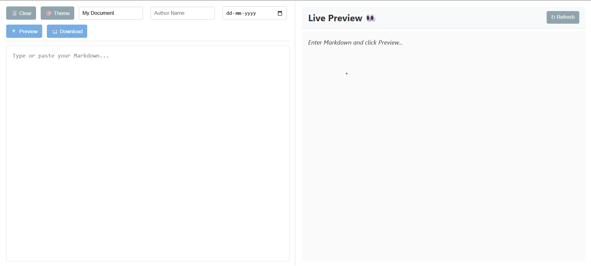

# 🚀 Advanced Markdown → Word Exporter 🤖

A full‑page, responsive Web App that transforms your Markdown into polished Word documents. Features modern UI contrast, animations, and works out‑of‑the‑box on all major browsers (incl. IE11!).



## ✨ Features

- 🔄 **Live Preview**: Instant Markdown → HTML via Showdown.js
- 🎨 **Dark/Light Themes**: Seamless toggle with color contrast optimized for readability
- 🚀 **Animations**: Button hover lifts, spinner loader, input focus highlights
- 📱 **Responsive**: Adapts from mobile to desktop
- 📄 **Word Export**: Generate `.docx` files with custom metadata
- 🧩 **Cross‑Browser**: Chrome, Firefox, Edge, Safari, IE11+

## 📦 Installation & Usage

```bash
# Clone repo
git clone https://github.com/you/advanced-markdown-word-exporter.git
cd advanced-markdown-word-exporter
# Open in browser
o index.html
```
## ✨ How To Use 📖

1. ✍️ **Paste or write** your Markdown into the left editor  
2. 🔍 **Click Preview** to see the formatted result live  
3. 📥 **Click Download** to generate and save your Word document

## 🗂️ Project Structure
```plaintext
advanced-markdown-word-exporter/
├── css/style.css   # Styles & animations
├── js/script.js    # Core logic + JSDoc comments
├── index.html      # App entry point
└── README.md       # This documentation
```

## 🛠️ Browser Support

| Browser        | Supported Versions |
| -------------- | ------------------ |
| Chrome         | Latest & 2 prior   |
| Firefox        | Latest & 2 prior   |
| Edge           | Latest & 2 prior   |
| Safari         | Latest & 2 prior   |
| Internet Expl. | 11                 |

---

> **Built with ChatGPT** 🤖
